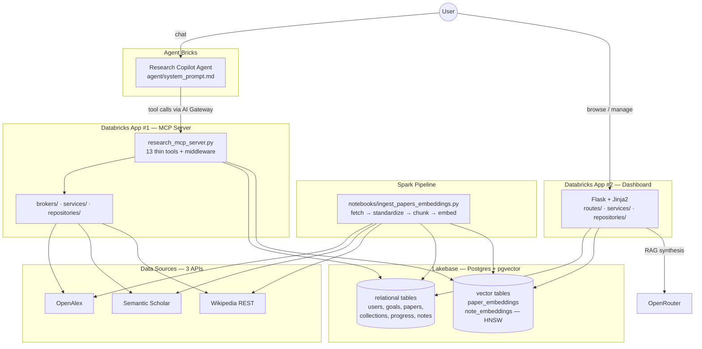

# AI Research & Learning Copilot

A portfolio-grade capstone for the **Rise of the AI Data Engineer** bootcamp. Users define learning objectives, discover academic papers across **three independent APIs**, curate them into collections, and work with an AI agent that builds personalized study plans, summarizes and compares research, and tracks reading progress — powered by **Databricks Lakebase**, **Spark**, **pgvector**, an **MCP server**, and **Agent Bricks**.

---

## Capstone Requirements — where each is met

| Requirement | Deliverable |
|---|---|
| **Data pipeline in Spark** | `notebooks/ingest_papers_embeddings.py` — distributed abstract embedding via `sentence-transformers` in batched pandas workloads, upserted to pgvector |
| **≥ 1 third-party API** | **Three:** OpenAlex (discovery), Semantic Scholar (TLDRs / influence / recommendations), Wikipedia REST (prerequisite context) — `mcp_server/brokers/` |
| **Processing unstructured data** | Paper abstracts, user notes, and topic summaries are chunked (800/100) and embedded into 384-dim vectors for semantic retrieval |
| **Databricks App with a frontend** | `dashboard/` — Flask + Jinja2, server-rendered, deployed as a Databricks App |
| **An AI agent that does stuff** | 13-tool MCP server the agent calls to **read and write** — collections, reading status, notes, reading plans — `mcp_server/` + `agent/` |

---

## Architecture



Every component follows the same layered contract: **config → repository (all SQL) → broker (all HTTP) → service (logic) → interface (MCP tools / Flask routes)**, with middleware for identity and observability. See `context/implementation-plan/implementation_plan.md` and the phase walkthroughs in `context/walkthrough/`.

---

## Repository Layout

```
ai-research-copilot/
├── requirements.txt              # unified dependency set for the whole project
├── requirements-dev.txt          # + pytest
├── setup_db.py                   # one-time: create schema + seed demo data
├── setup_secrets.py              # one-time: push .env values to Databricks secret scopes
├── .env.example                  # local dev config template
│
├── sql/                          # 01 relational · 02 pgvector + HNSW · 03 mcp_traces
├── notebooks/                    # Spark ingestion + embedding pipeline
├── mcp_server/                   # Databricks App #1 — FastMCP, 13 tools
├── agent/                        # Agent Bricks config + system prompt
├── dashboard/                    # Databricks App #2 — Flask dashboard
└── tests/                        # pytest — endpoint auth, routing, service logic
```

---

## Quick Start (local)

```bash
cd ai-research-copilot
python -m venv ../venv && ../venv/Scripts/activate      # Windows
# source ../venv/bin/activate                            # macOS / Linux
pip install -r requirements-dev.txt

cp .env.example .env      # then fill in DATABASE_URL + API keys

python setup_db.py        # create tables + seed demo user/goals/papers
python -m pytest          # 45 tests, no DB or network needed

flask --app dashboard.app run --debug --port 8080        # → http://localhost:8080
```

To run the ingestion pipeline or MCP server locally, and to deploy everything to Databricks, follow **`context/setup/setup_guide.md`** — a step-by-step guide for every component, local and on Databricks.

---

## Running each component

| Component | Local | Databricks |
|---|---|---|
| **Schema** | `python setup_db.py` | same, or run `sql/*.sql` in a SQL editor against Lakebase |
| **Ingestion pipeline** | `python notebooks/ingest_papers_embeddings.py` | import the notebook, attach a cluster, Run All (or schedule as a Job) |
| **MCP server** | `python mcp_server/research_mcp_server.py` (needs `mcp<2`) | deploy `mcp_server/` as a Databricks App |
| **Agent** | n/a (managed) | Agent Bricks UI — paste `agent/system_prompt.md`, attach the MCP server URL |
| **Dashboard** | `flask --app dashboard.app run` | deploy as a Databricks App with `REQUIRE_FORWARDED_AUTH=true` |

---

## Demo walkthrough

1. **`/`** — the seeded demo user starts with 3 learning goals, 3 papers, 1 collection, some progress.
2. **`/search?q=attention&mode=keyword`** — keyword search; switch to `mode=semantic` for pgvector cosine ranking (needs the pipeline to have run so embeddings exist).
3. Open a paper → mark it **reading**, write a note, **add it to a collection**.
4. **`/collection/<id>`** → **Generate reading plan** — papers re-sequence by publication year then citation impact; drag rows to override.
5. **`/progress`** — drag papers between `not_started / reading / completed / skipped`.
6. Ask the **agent**: *"Build me a reading plan for understanding transformers"* — it searches, creates a collection, adds papers, and sequences them, citing every paper.

---

## Design decisions

- **Broker pattern (strict SRP)** — each external API lives in one `*_broker.py`; services orchestrate, brokers never touch the DB, tools/routes never call `requests`.
- **Thin interface layer** — every MCP tool and Flask route is a one-call delegation; logic lives in services, SQL in repositories.
- **Idempotent writes** — every upsert is `INSERT … ON CONFLICT … DO UPDATE` with `COALESCE` so pipeline re-runs never clobber enrichment fields.
- **Two independent Databricks Apps** — the dashboard talks straight to Lakebase; the reading-plan heuristic is *copied* into both apps rather than shared over HTTP, so neither app's outage is the other's.
- **Query embedding == pipeline embedding** — same model, same `normalize_embeddings=True`, or cosine ranking silently degrades.
- **Identity from the proxy header** — no login form; `X-Forwarded-Email` in prod, demo user locally, `401` in prod if the header is missing.

---

## Tests

```bash
python -m pytest            # from ai-research-copilot/
```

`tests/` runs fully offline (in-memory repository stub, stubbed embedding + LLM):

- **`test_auth.py`** — identity resolution in both auth modes, `401` on missing/blank header, `/healthz` and static assets stay open, cross-user data isolation.
- **`test_routes.py`** — every endpoint's happy path, input validation, and JSON-vs-redirect negotiation.
- **`test_services.py`** — reading-plan sequencing, chunk-to-paper folding, pagination flags.

---

## Documentation

| Doc | Contents |
|---|---|
| `context/implementation-plan/implementation_plan.md` | Full architecture, layer contract, phased build plan |
| `context/setup/setup_guide.md` | Step-by-step setup for every component — local and Databricks |
| `context/walkthrough/phase_*_walkthrough.md` | What each phase built, why, and the concepts behind it |
| `context/task/task.md` | Build tracker |
| `*/README.md` | Per-directory design decisions |
